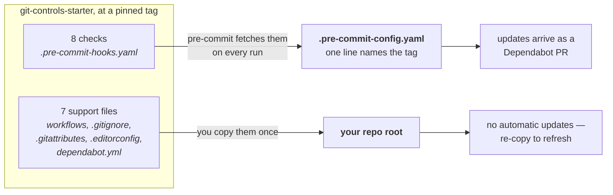
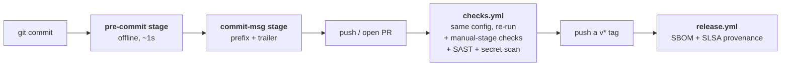
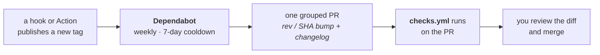

# git-controls-starter

A set of git and GitHub controls you point your repo at. A machine enforces hygiene,
secret-safety, commit discipline and a hardened CI, so a broken invariant fails like a
red build instead of slipping past a tired reviewer.

Language-agnostic — nothing here assumes your stack.

## How it reaches your repo

pre-commit distributes **hooks**, not **files**. That single fact explains the whole
install, so it is worth seeing before you run anything:



The checks are never vendored, so there is no copy to drift. The support files must be
copied, because a pre-commit repo cannot ship a workflow or a `.gitignore`.

## Install

Prerequisite: `pre-commit` on your PATH — `pipx install pre-commit` or
`brew install pre-commit`.

Everything is fetched from a **tag**, never `main`, so a re-run next month gets the same
bytes. The first line resolves the newest tag for you.

```bash
TAG=$(git ls-remote --tags --sort=-v:refname \
  https://github.com/pedro-angel/git-controls-starter 'v*' \
  | grep -v '\^{}' | head -1 | sed 's|.*refs/tags/||')
BASE=https://raw.githubusercontent.com/pedro-angel/git-controls-starter/$TAG

curl -fsSL "$BASE/examples/.pre-commit-config.yaml" -o .pre-commit-config.yaml

for f in .gitignore .gitattributes .editorconfig .github/dependabot.yml \
         .github/workflows/checks.yml .github/workflows/security-scan.yml \
         .github/workflows/release.yml; do
  mkdir -p "$(dirname "$f")"
  if [ -e "$f" ]; then   # never clobber a file you already have
    curl -fsSL "$BASE/$f" -o "$f.upstream" && echo "wrote $f.upstream — merge by hand"
  else
    curl -fsSL "$BASE/$f" -o "$f"
  fi
done

pre-commit install --install-hooks && pre-commit run --all-files
```

Then append your own linters at the bottom of the config, and add your package ecosystem
to `dependabot.yml`.

## When each check runs

Checks are split across three moments so a fresh clone never waits on the network:



`checks.yml` re-runs the identical `.pre-commit-config.yaml`, so "passes on my machine"
and "passes in CI" cannot diverge. The network-dependent checks sit at the manual stage
and are invoked explicitly in CI — a `rev` bump alone never runs them.

## The checks

Generated from [`.pre-commit-hooks.yaml`](.pre-commit-hooks.yaml) — the manifest is the
source of truth.

| id | stage | what it asserts |
| --- | --- | --- |
| `check-no-tracked-secrets` | pre-commit | no secret-looking file is tracked by git |
| `check-one-pin-per-action` | pre-commit | every Action is SHA-pinned, one pin per action repo-wide |
| `check-no-private-identifiers` | pre-commit | no private identifier (hostname, internal name) enters the repo |
| `check-commit-trailer` | commit-msg | commit body carries a provenance trailer |
| `check-evidence-trailer` | commit-msg | live-surface commits carry an `Evidence:` trailer |
| `check-pin-comments-match` | manual | every pin's `#` comment still dereferences to its SHA |
| `check-diagrams-rendered` | manual | every mermaid fence rendered in the built docs |
| `vocabulary-conformance` | pre-commit | make targets conform to the shared cross-repo vocabulary |

Three ship commented in the example config, because each fails closed on a repo that has
nothing for it to read: `check-evidence-trailer` needs `EVIDENCE_PATH_REGEX`,
`check-diagrams-rendered` needs a built docs tree, `vocabulary-conformance` needs a root
`Makefile`. Uncomment the ones that apply to you.

Every check is **fail-closed**: it exits non-zero when its target is missing, so a green
run never means "ran against nothing". Where a check needs the network, it separates a
real failure from an unreachable lookup — exit 1 is a violation, exit 2 means it could
not check, and it never reports the second as the first.

## What the support files buy you

- **`.gitignore`** makes secret files physically un-committable. `check-no-tracked-secrets`
  catches one that was committed *before* it was ignored.
- **`checks.yml`** runs least-privilege (`permissions: contents: read`), with
  `timeout-minutes` and `concurrency` cancel. Beyond re-running your config it adds SAST
  (`shellcheck` on shell, `Semgrep` on workflow YAML), a full-history `gitleaks` scan
  pinned by SHA-256 of the binary, and `dependency-review` on PRs.
- **`security-scan.yml`** re-runs the deep secret and SAST scan weekly, so a newly
  published rule catches an old commit. `osv-scanner`, `Trivy` and `CodeQL` ship
  commented — on a dependency-free repo they would scan nothing and pass, which this repo
  treats as a bug. Uncomment when you have dependencies or app code.
- **`release.yml`** turns a `v*` tag into a GitHub Release carrying an SBOM and a keyless
  SLSA provenance attestation. Consumers verify with
  `gh attestation verify <file> --repo <owner>/<repo>`.
- **`dependabot.yml`** watches your Actions *and* your pre-commit revs. See below.
- **`.gitattributes` + `.editorconfig`** keep line endings LF everywhere.

## Staying current

Two pinned surfaces, one mechanism:



The 7-day cooldown means a freshly published — possibly compromised — version is not
proposed on day one. Grouping means the weekly sweep lands as one reviewable PR instead
of a pile that goes stale and conflicts.

**Dependabot bumps `rev`, never your hook list.** When a tag ships a *new* check, add its
`id` to your config yourself. If that check is manual-stage, also add an explicit CI step
after your default-stage run:

```bash
pre-commit run check-pin-comments-match --hook-stage manual --all-files
```

## Repo settings you must enable

Some controls live in settings, not files — no YAML can turn them on. Under
*Settings → Code security*, in order, because each unlocks the next:

1. **Dependency graph** — `dependency-review` fails closed without it. Everything below needs it.
2. **Dependabot alerts** — notifies you when a dependency has a known advisory.
3. **Dependabot security updates** — alert-driven patch PRs. Distinct from the committed
   `dependabot.yml`, which drives *scheduled* version bumps. Run either, both, or neither.
4. **Code scanning** — enables the SARIF tab the commented `osv-scanner`/`Trivy` drop-ins
   upload to. Grant that job `security-events: write` when you uncomment them.
5. *(optional)* **Secret scanning + push protection** — a server-side complement to `gitleaks`.

Publishing your own repo? Update the MIT `LICENSE` copyright holder, add a `SECURITY.md`
with private vulnerability reporting, and tag releases with semver so *your* consumers can
pin a version.

## Extend it

- **Add your own invariants.** The value is in checks no off-the-shelf linter can write.
  [`check-no-tracked-secrets.sh`](scripts/checks/check-no-tracked-secrets.sh) is a worked
  template: glob your files, assert a property, exit non-zero. Register it under
  `repo: local`. Keep it fail-closed.
- **Make claims carry proof.** Turn on `check-evidence-trailer` for the paths whose
  correctness rests on a live run — integration clients, deploy config. Commits touching
  them must then cite the artifact that proves the claim.
- **Team workflow.** Uncomment `no-commit-to-branch`, and enable branch protection on
  `main` with `checks` as a required status check.

## Working on this repo

```bash
pre-commit install --install-hooks   # both stages
pre-commit run --all-files           # exactly what CI runs
```

Related: the [agent-methodology](https://github.com/pedro-angel/agent-methodology) pack.
The two do not overlap — this repo owns the git controls, the pack owns the prose
(`AGENTS.md`, `skills/`, agent adapters). Any order works.
